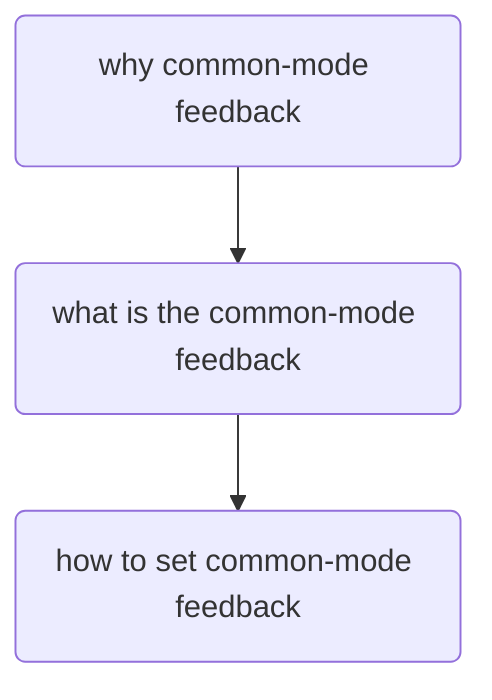

# common-mode-circuits-analysis
based on the book of Gray and Meyer-"Analysis and Design of analog integrated circuits", the content from 12 chapter fully differential operational amplifiers-common-mode feedback.

