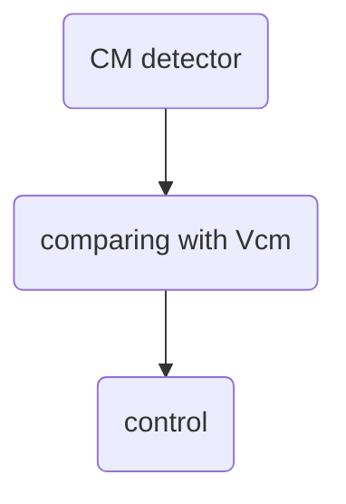

common-mode fb consists of three parts.

way 1: resistor detector (or plus a source flower) feedback to tail current

way 2: current stacked(mos in linearity region)

way 3: switching capacitor circuits. 
